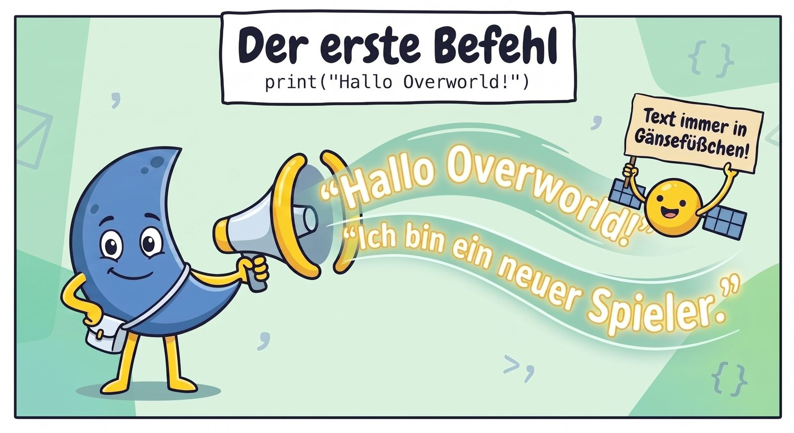
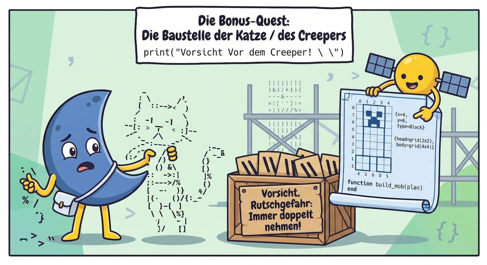

# ⛏️ Unit 1: "Hallo Overworld!" — Der erste Befehl



## Was lernen wir?
Wie sagt man dem Computer, dass er etwas auf den Bildschirm schreiben soll? Mit dem Befehl `print`. Klammern hinter dem Wort, und in den Klammern das, was geschrieben werden soll. Text muss in Anführungszeichen `"..."`.

### Beispiel
Lege in VSCodium eine Datei `hallo.lua` an:

```lua
print("Hallo Overworld!")
print("Ich bin ein neuer Spieler.")
print("Mein Lieblingsblock ist Diamant.")
```

Speichern (Strg+S) und im Terminal ausführen:

```bash
lua hallo.lua
```

Es erscheinen drei Zeilen untereinander.

## Übungsquests

### 🎯 Quest 1.1: Stelle Dich vor
Schreibe ein Programm, das **vier Zeilen** ausgibt:
- Deinen Spielernamen
- Deinen Lieblingsblock
- Deinen Lieblingsmob
- Dein Lieblingsbiom

### 🏆 Bonus-Quest: ASCII-Creeper
Versuche mit `print`, einen Creeper zu malen:
```lua
print(" /\\_/\\ ")
print("( o.o )")
print(" > ^ < ")
```

(Das ist eher eine Katze — kannst Du einen echten Creeper bauen?)

> 💡 `\\` ist ein Trick: Weil `\` in Strings eine Sonderbedeutung hat, schreibt man `\\`, wenn man wirklich einen Backslash ausgeben will.



---
⬅️ [Übersicht](README.md) · ➡️ [Unit 2: Inventar-Slots — Variablen](unit02-variablen.md)
