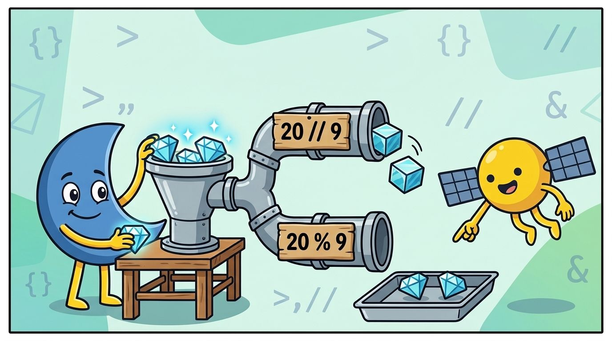

# 💎 Unit 3: Rechnen wie ein Redstone-Ingenieur

## Was lernen wir?
Lua kann rechnen wie ein Taschenrechner. Aber ein paar Zeichen sehen anders aus als in der Schule — und ein neues Zauberwort (`local`) kommt auch noch dazu.

### Die Rechenzeichen: Schule vs. Lua

| In der Schule | In Lua | Beispiel |
|---------------|--------|----------|
| 5 + 3 | `+` | `5 + 3` → 8 |
| 10 − 4 | `-` | `10 - 4` → 6 |
| 7 · 6 (mal) | `*` | `7 * 6` → 42 |
| 20 : 4 (geteilt) | `/` | `20 / 4` → 5.0 |

Plus und Minus sind wie gewohnt. Für **Mal** nimmt man das Sternchen `*` (ein Mal-Punkt ist auf der Tastatur schlecht zu tippen). Für **Geteilt** den Schrägstrich `/`.

> **⚠️ Kommazahlen: Punkt statt Komma!**
>
> In Lua (und fast allen Programmiersprachen) schreibt man Kommazahlen mit einem **Punkt**: `2.5` statt `2,5`.
>
> Deshalb zeigt Lua bei `20 / 4` auch `5.0` an — das ist einfach "fünf Komma null". Das Geteilt-Zeichen `/` gibt Dir **immer** so eine Kommazahl zurück, sogar wenn die Aufgabe glatt aufgeht.

Und wie in der Schule gilt auch in Lua: **Punkt vor Strich.** `2 + 3 * 4` ergibt 14, nicht 20. Mit Klammern kannst Du das ändern: `(2 + 3) * 4` ergibt 20.


## Teilen mit Rest: Was passt komplett rein und was bleibt übrig?


"17 geteilt durch 5 ist **3, Rest 2**" — genau so hast Du das Teilen gelernt. Lua kann das auch, mit zwei Spezial-Zeichen:

| Zeichen | Was es verrät | Beispiel |
|---------|---------------|----------|
| `//` | Wie oft passt es **ganz** rein? | `17 // 5` → 3 |
| `%` | Was bleibt als **Rest** übrig? | `17 % 5` → 2 |



`//` und `%` sind ein Team — zusammen sind sie das "Teilen mit Rest" aus der Schule. In Minecraft braucht man das ständig: 9 Barren ergeben 1 Block. Wie viele **ganze** Blöcke bekommst Du aus 20 Diamanten, und wie viele Diamanten bleiben übrig? Genau dafür sind `//` und `%` da.

## 🆕 Neu: `local` — der Profi-Stempel für Variablen
Ab dieser Unit schreiben wir vor jede **neue** Variable das Wort `local`:

```lua
local diamanten = 20
```

`local` heißt: "Dieser Slot gehört nur zu diesem Programm." Es funktioniert auch ohne — aber Profis schreiben es **immer** dazu, und in Phase 3 (wenn unser Code sich eine Welt mit hunderten anderen Mods teilt) ist es sogar überlebenswichtig. Deshalb gewöhnen wir es uns **jetzt gleich** an.

Merkregel: `local` nur beim **ersten Mal**, wenn der Slot angelegt wird. Wenn Du den Wert später änderst (`diamanten = 15`), brauchst Du kein `local` mehr — der Slot existiert ja schon.

### Beispiel
```lua
local diamanten = 20
local bloecke = diamanten // 9
local rest = diamanten % 9
print("Aus " .. diamanten .. " Diamanten: " .. bloecke .. " Blöcke, " .. rest .. " bleiben übrig.")

local erz_pro_stunde = 64
local stunden = 5
local gesamt = erz_pro_stunde * stunden
print("In " .. stunden .. " Stunden: " .. gesamt .. " Erz")
```

## Übungsquests

### 🎯 Quest 3.1: Der Crafting-Rechner
Schreibe ein Programm:
- Du hast 73 Eisenbarren
- Wie viele Eisenblöcke kannst Du craften? (9 Barren = 1 Block)
- Wie viele Barren bleiben übrig?

> Tipp: `//` gibt die ganzen Blöcke, `%` den Rest. Und denk an `local`!

### 🏆 Bonus-Quest: Wie lange bis Level 30?
Ein Spieler bekommt 7 XP pro Mob. Er braucht 825 XP für Level 30.

Lass Dein Programm zwei Zeilen ausgeben:
- wie viele Mobs er schafft, wenn er die 825 XP in **volle Mobs** aufteilt (`//`)
- wie viele XP dann **noch fehlen** (`%`)

Und jetzt Du: Reichen so viele Mobs schon? Wie viele muss er **wirklich** besiegen? Diese letzte Antwort gibst Du selbst — Dein Programm hat Dir alles verraten, was Du dafür brauchst.

---
⬅️ [Unit 2](unit02-variablen.md) · [Übersicht](README.md) · ➡️ [Unit 3½: Variablen-Namen](unit03b-variablennamen.md)
