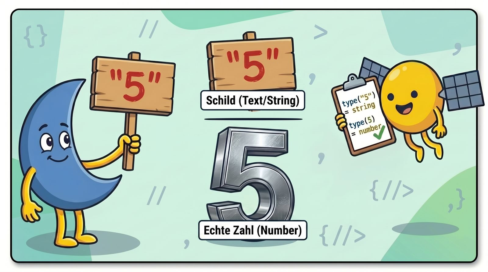
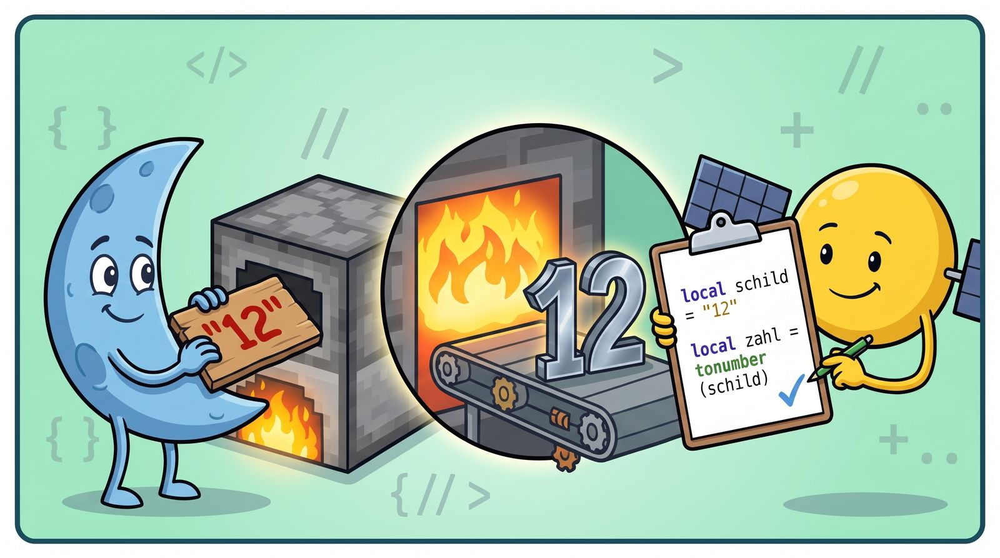

# 🔥 Unit 4½: Der Schmelzofen — `tonumber`

## Was lernen wir?
In Unit 4 hat Dein Programm Antworten entgegengenommen. Heute klären wir, **was** da eigentlich ankommt — und warum Profis es erst durch den Ofen schicken, bevor sie damit rechnen.

### Zwei Sorten von Dingen: Schilder und Zahlen
In Lua gibt es (unter anderem) zwei Sorten von Dingen:

- **Echte Zahlen** — mit denen kann man rechnen: `5`, `42`, `2.5`
- **Text** — Buchstaben, wie auf ein **Schild** gemalt: `"Hallo"`, `"Steve"`

Die Anführungszeichen kennst Du seit Unit 1 — sie sind sozusagen das Schild drumherum. Und jetzt kommt's: `"5"` ist **nicht** die Zahl 5. Es ist ein Schild, auf das jemand eine 5 gemalt hat!

**Alles, was Du mit `io.read()` eintippst, kommt als Schild an.** Auch wenn Du `12` tippst — das Programm bekommt ein Schild mit "12" drauf, keine echte Zahl.

### 🧪 Experiment 1: Der Detektiv lernt die Sorten kennen
Glaubst Du nicht? Dann fragen wir Lua einfach selbst! Es gibt ein Detektiv-Werkzeug: `type(...)` verrät Dir von allem die **Sorte**. (Es liegt ohne Kiste direkt griffbereit, wie `print` — Detektivarbeit braucht man eben ständig.)

Erst schauen wir, was der Detektiv zu Dingen sagt, deren Sorte wir schon kennen:

```lua
print(type("Hallo"))   -- string  (Schild)
print(type(5))         -- number  (echte Zahl)
print(type("5"))       -- na, was wohl?
```

Die ersten beiden sind keine Überraschung: `string` heißt Schild, `number` heißt echte Zahl. Und die dritte Zeile? **`string`** — die Anführungszeichen machen den Unterschied, genau wie oben behauptet.




### 🧪 Experiment 2: Der Detektiv untersucht die Eingabe
Jetzt kommt der spannende Teil. Wir lassen den Detektiv untersuchen, was `io.read()` liefert:

```lua
print("Tippe eine Zahl!")
local eingabe = io.read()
print(type(eingabe))
```

Starte das Programm und tippe `12` ein — **ohne** Anführungszeichen, einfach die Ziffern. Lua sagt trotzdem: **`string`** — ein Schild! Du hast eine Zahl *getippt*, aber angekommen ist ein Schild, auf dem "12" steht. Da hilft kein Leugnen: Der Detektiv hat es schwarz auf weiß.

## Der Schmelzofen: `tonumber`
Wie kommen wir vom Schild zur echten Zahl? Mit `tonumber(...)` — das ist wie der **Ofen** in Minecraft: Eisenerz rein, Eisenbarren raus. Hier: Schild rein, echte Zahl raus.

```lua
local schild = "12"            -- ein Schild mit "12" drauf
local zahl = tonumber(schild)  -- geschmolzen: die echte Zahl 12
print(type(zahl))    -- number - der Detektiv bestätigt es
```




> ⚠️ **Was passiert mit Unschmelzbarem?** Wenn Du etwas in den Ofen legst, das keine Zahl ist — `tonumber("Hallo")` — kommt **nichts** raus (Lua nennt das `nil`). Damit kann man dann natürlich auch nicht rechnen.
>
> **Lua ist manchmal schlau und schmilzt heimlich selbst**: `"12" + 1` funktioniert tatsächlich! Warum dann überhaupt `tonumber`? Zwei Gründe: 
> 
> 1. Das heimliche Schmelzen klappt nur, solange *wirklich eine Zahl auf dem Schild steht*. Tippt jemand statt `3` das Wort `drei`, kracht Dein Programm mitten in der Rechnung zusammen. 
> 2. Beim **Vergleichen** (kommt in Unit 5½) schmilzt Lua **nie** heimlich — da ist das Schild `"12"` niemals gleich der Zahl `12`, und Du suchst ewig den Fehler. 
>
> Profi-Regel: **Schilder mit Zahlen drauf immer selbst schmelzen.**

## ⚔️ Übungsquests

### 🎯 Quest 4½.1: Der Zahlen-Addierer
Bau ein Programm, das folgende Dinge tut:

1. Es fragt Dich nach der ersten Zahl
2. Es fragt Dich nach der zweiten Zahl
3. Es verwandelt die beiden Eingaben jeweils zu Zahlen (2x Schmelzofen!).
4. Dann zählt es sie zusammen und gibt die **Summe** aus — bei den Zahlen `3` und `4` muss also `7` rauskommen

Und wenn es läuft, ein Spaß zum Schluss: Ersetze im Programm das `+` mal durch `..` — kleben statt rechnen. Aus 3 und 4 wird **34**! Jetzt weißt Du auch, was schiefgelaufen ist, wenn Dir sowas mal in einem echten Programm passiert.

### 🏆 Bonus-Quest: XP-Rechner
Frage nach dem aktuellen Level und dem Ziel-Level des Spielers. Gib aus, wie viele Level noch fehlen. Vergiss den Schmelzofen nicht!

---
⬅️ [Unit 4](unit04-eingaben.md) · [Übersicht](README.md) · ➡️ [Unit 5: if und else](unit05-if-else.md)
